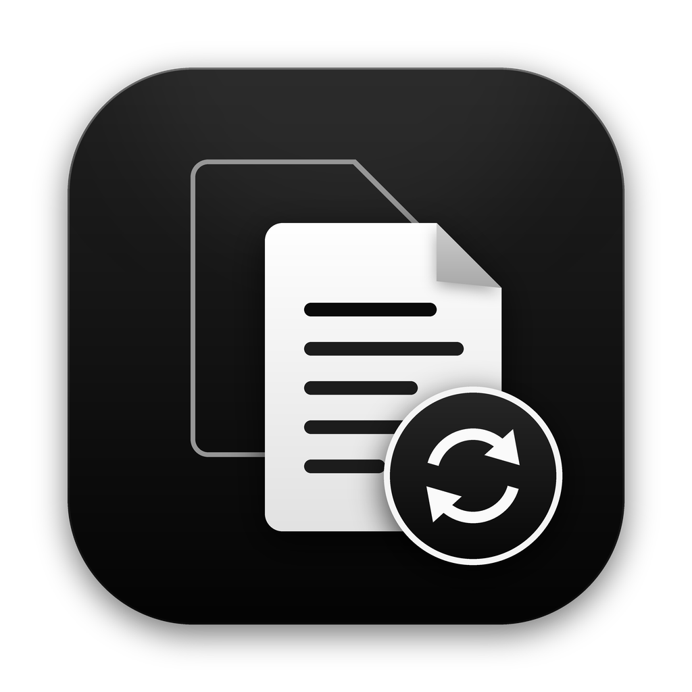

<p align="center">
  
</p>

<h1 align="center">Document Converter</h1>

<p align="center">
  Convert documents, spreadsheets, presentations and eBooks between 35+ formats.<br>
  Drag in your files, pick a format, click Convert. Works offline, nothing is uploaded.
</p>

---

## Download

| Your computer | Download | |
|---|---|---|
| Windows 10 or 11 | [**Installer (.exe)**](https://github.com/joemunene-by/Document-Converter/releases/latest/download/DocumentConverter-Windows-Setup.exe) | [portable .zip](https://github.com/joemunene-by/Document-Converter/releases/latest/download/DocumentConverter-Windows-Portable.zip) |
| Mac with Apple chip (M1, M2, M3, M4) | [**Disk image (.dmg)**](https://github.com/joemunene-by/Document-Converter/releases/latest/download/DocumentConverter-macOS-Apple-Silicon.dmg) | |
| Mac with Intel chip | [**Disk image (.dmg)**](https://github.com/joemunene-by/Document-Converter/releases/latest/download/DocumentConverter-macOS-Intel.dmg) | |
| Linux (64-bit) | [**Archive (.tar.gz)**](https://github.com/joemunene-by/Document-Converter/releases/latest/download/DocumentConverter-Linux-x86_64.tar.gz) | |

Not sure which Mac you have? Click the Apple menu, then **About This Mac**. It says "Chip: Apple M..." or "Processor: Intel".

All versions are on the [Releases page](https://github.com/joemunene-by/Document-Converter/releases).

## Install

### Windows

1. Open `DocumentConverter-Windows-Setup.exe`.
2. If Windows shows "Windows protected your PC", click **More info**, then **Run anyway**. This appears because the app is new and not yet code-signed.
3. Follow the installer. No administrator password is needed. Document Converter is added to the Start menu (and the desktop if you tick the box).

### Mac

1. Open the `.dmg` file and drag **Document Converter** onto the **Applications** folder.
2. Open Document Converter from Applications. The first time, macOS may say it "cannot be opened because Apple cannot check it".
3. Open **System Settings**, then **Privacy & Security**, scroll down and click **Open Anyway** next to Document Converter. You only need to do this once.

### Linux

```sh
tar -xzf DocumentConverter-Linux-x86_64.tar.gz
./DocumentConverter-linux/install.sh
```

Document Converter then appears in your app menu.

## Use

1. Drag files (or a whole folder) into the window, or click to browse.
2. Choose a format under **Convert to**.
3. Click **Convert**. Converted files are saved next to the originals, or in a folder you choose under **Save to**. Existing files are never overwritten: a new copy is named `report (1).pdf`.

Click **Open** on a finished file to open it, or **Show in folder** to find it. The moon and sun button switches between dark and light.

## Formats

| Kind | Formats |
|---|---|
| Documents | PDF, Word (.docx), OpenDocument (.odt), Rich Text (.rtf), Word 97-2003 (.doc)\*, Apple Pages\*, WordPerfect\*, Works\* |
| Spreadsheets | Excel (.xlsx, .xlsm), Excel 97-2003 (.xls), OpenDocument (.ods), CSV, TSV, Apple Numbers\* |
| Presentations | PowerPoint (.pptx), PowerPoint 97-2003 (.ppt)\*, OpenDocument (.odp)\*, Apple Keynote\* |
| Text and markup | Markdown, plain text, HTML, LaTeX, reStructuredText, AsciiDoc, Org, Typst, Textile, MediaWiki, Jupyter Notebook |
| eBooks | EPUB, FictionBook (.fb2) |
| Other | Publisher (.pub)\*, Visio\*, OpenDocument Drawing\* (to PDF only) |

Any format can be converted to any other where that makes sense: a Word file to PDF, Markdown or EPUB, a spreadsheet to a Word table or PDF, a presentation to a document, tables in a document to Excel, and so on.

\* These formats need [LibreOffice](https://www.libreoffice.org/download/download-libreoffice/), which is free. Install it and Document Converter finds it automatically. With LibreOffice installed, Office files are also converted to PDF with their exact original layout.

### Good to know

- PDFs are converted by their text. Scanned PDFs (photos of pages) have no text to extract and need OCR software first.
- Converting between different kinds of file (for example a presentation to a spreadsheet) keeps the text and tables, not the visual design.
- Nothing leaves your computer. There is no account, no upload and no internet connection needed.

## Command line

The app also works from a terminal:

```sh
docconv report.docx -t pdf
docconv *.md -t docx -o converted/
docconv --formats
```

## For developers

Requires Python 3.9 or newer.

```sh
git clone https://github.com/joemunene-by/Document-Converter.git
cd Document-Converter
python -m venv .venv
source .venv/bin/activate          # Windows: .venv\Scripts\activate
pip install -e ".[dev]"
document-converter                  # open the app
pytest                              # run the tests
```

How it works: pandoc (bundled through `pypandoc-binary`) handles text documents, Typst (bundled through `typst`) typesets PDFs, openpyxl, xlrd and odfpy handle spreadsheets, python-pptx reads presentations and pypdf reads PDFs. LibreOffice is used when present. The code is in `src/document_converter/`:

| File | Role |
|---|---|
| `formats.py` | Every supported format and how it can be read and written |
| `converter.py` | Plans and runs each conversion |
| `engines.py` | pandoc, Typst and LibreOffice wrappers |
| `tabular.py`, `extractors.py` | Spreadsheets, PDF and PowerPoint reading |
| `gui/` | The desktop app (Qt) |
| `cli.py` | The `docconv` command |

### Building the app

```sh
pip install pyinstaller
pyinstaller packaging/DocumentConverter.spec --noconfirm
```

The app is written to `dist/`. To publish a release for every platform, bump `__version__` in `src/document_converter/__init__.py`, then push a tag:

```sh
git tag v1.0.0
git push origin v1.0.0
```

GitHub Actions then builds the Windows installer, both Mac disk images and the Linux archive, and attaches them to a new release. The download links above always point to the latest release.

To change the icon, edit `scripts/make_icon.py` and run it (needs Pillow).
